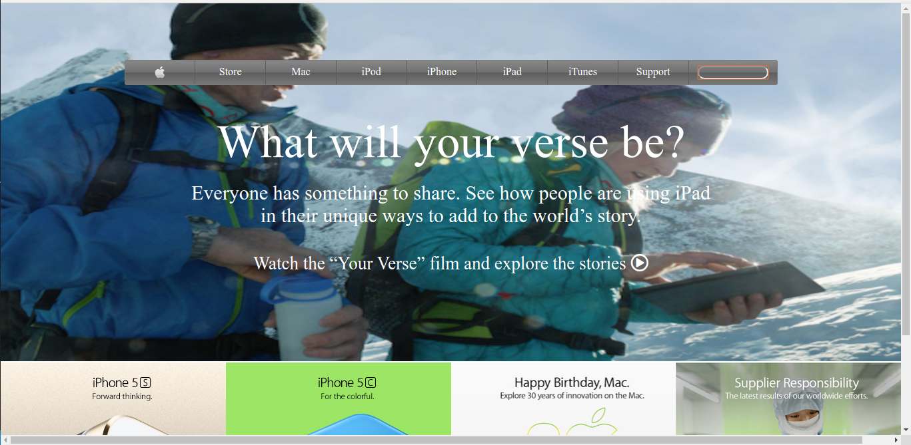

# 2014 Apple page clone

> This is a web page that looks similar to the Apple web page of 2014

## Built With

- HTML,
- CSS

## Live Demo

[Live Demo Link](https://rawcdn.githack.com/LOctavio/apple-page-2014/aeee43a8c4c87c077731805d586584744e8b6d2b/index.html)

## Authors

👤 **Luis Octavio Ramirez Cruz**

- Github: [@LOctavio](https://github.com/LOctavio)
- Twitter: [@Octavio_ram431](https://twitter.com/Octavio_ram431)
- Linkedin: [linkedin](https://www.linkedin.com/in/luis-octavio-ramirez-cruz-714521178/)

## 🤝 Contributing

Contributions, issues and feature requests are welcome!

Feel free to check the [issues page](issues/).

## Show your support

Give a ⭐️ if you like this project!

## 📝 License

This project is [MIT](lic.url) licensed.
